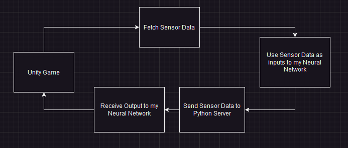
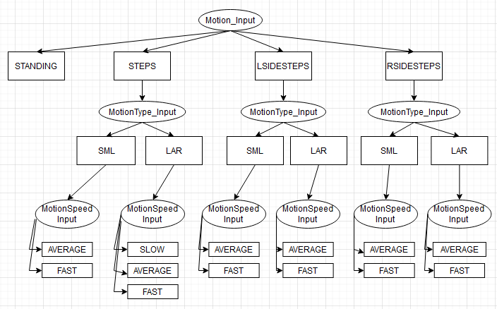

# vr-kat-project-python-research
# KATNN: KAT Walk C: Motion Capture and Machine Learning to Predict Human Motion

## Description

This project focuses on utilizing Machine Learning and Neural Networks in order to make predictions on the trajectory of the virtual character based on Motion Capture Data collected from the accompanied research project unity game. This project focuses on creating a local server (in this particular instance, a Websocket server) in order to bidirectionally communicate with our unity game, and also contains of all of the training data used in order to cover all the steps of machine learning, pre-processing data, graphing data, as well as creating our final neural network. 

<figure>
  
  <figcaption>Figure 1: This figure starts from the Unity Game, which then collects sensor data, this data is then sent to this server to make trajectory predictions which is then communicated back to our unity game.</figcaption>
</figure>

In the design of our prediction algorithm, we essentially have three layers of predictions which can seen iin figure 2, the first layer representing the type of motion the person is doing (STANDING, STEPS, LSIDESTEPS, RSIDESTEPS), the second layer is given the motion, how big of the steps they are taking (SMALL, LARGE), and finally given the motion and how big the step, how fast they are doing this motion (SLOW, AVERAGE, FAST). 

<figure>
  
  <figcaption>Figure 2: This figure shows the logic of our prediction algorithm. Where oval labels represent a Neural Network and rectangle labels represent all of the classes for that Neural Network </figcaption>
</figure>

## Required Python Packages

This project will require Python version 3.6 or higher and all of the following packages:

- pip install pandas
- pip install numpy
- pip install scikit-learn
- pip install tensorflow
- pip install asyncio
- pip install websockets
- pip install openpyxl

## Installation & Usage

Once all Python packages are installed, go to "./python-servers/webSocketServer_Sync.py" and run the script, this should run the WebSocket Server for the Research Unity Game to communicate. Make sure the server is running before the game is launched, orelse the game will try to look for a server on that port which does not exist as it is not running. 

For the purpose of testing without a KAT Walk, you have the ability to test the Neural Network by feeding it an array of size 26x4. I have done a few test whidch I commented out, if you search for "DEV" in that same script as mentioned above, you will see the sample code I used to test my neural network. 

This package comes with the trained neural networks (hence why no training is necessary), in the event you want to change the algorithm or create a new neural network, refer to Technical Details on how to do that. 

## Technical Details

In this section we will explore understanding the file structure I created and scripts created in the event you wish to make modifications or just want to have a better understanding of this project. 

### File Structure

- config folder: This folder contains parameters and functions used throughout the project, this is so that the parameter will only need to be changed here rather than EACH file. 
    - config.json - global parameters used
    - config.py - global functions used
    - velocityConfig.json - each predicted class is given a velocity (trajectory), all of those class, velocities are found here.

- graphs folder: this folder contains all of the graphs used for the report utilizing matplotlib. 

- NeuralNetwork folder: this folder contains all of the pre-processed logic/data, the training logic for our neural networks, and the trained neural networks. 
    - archived folder: unused/old attempts at creating a neural network.
    - models folder: all saved neural network models
    np-saved-data folder: all saved numpy data (in this case, is the preprocessed data for training)
    - classify-... folder (ex. classify-motion folder): each folder represents a neural network. In each folder contains the logic to pre-process the data as well as using that pre-processed data to train the neural network and save it. 

- processed-training-data folder: This folder contains all of the training data in the form of raw data (data extracted from the unity game) and processed data (altered data after running a python script). 
    - 1-RAW-CSV folder: this folder will contain the raw csvs from the unity game.
    - 1-RAW-VIDEO video: this folder will contain the associated video recorded for each of the csvs in RAW-CSV (each time we recorded sensor data, we recorded a video to see the motion and compare it to the data). 
    - 4-PROCESSED-DATA: this folder will contain all of the processed data by running the python scripts in this folder. This is important since for training purposes, this folder will be referenced. 

- python-servers folder: This contains all python servers
    - webSocketServer_Sync.py: this contains all of the algorithm logic and the websocket server logic. 

### Neural Networks and Training

In the event you want to make modifications to an existing neural network, or you want to make a new neural network given the same infrastructure as the ones I created, you essentially need to do the following:

At a high level, what you need to do is essentially run all of the processed-training-data scripts which will convert our raw data to processed data. Once that is ready, we then need to run the scripts to preprocess the training and test data. Once done, you can run the training on the neural network. 

To do part 1 (process the raw data), locate the following folders and run the folowing files:
1. "\processed-training-data\4-PROCESSED-DATA\TRAIN2\python-process-script\"
    1. process-raw-steps-csv.py
    2. process-raw-standing.py
    3. process-raw-sidesteps-csv.py
    4. process-data-augment.py

2. "\processed-training-data\4-PROCESSED-DATA\TEST2\python-process-script\"
    1. process-test-steps-csv.py
    2. process-sidesteps-diagonals-csv.py
    3. process-data-augment.py

After that, you should have a bunch of xlsx files in those two folders.

Part two, in "\NeuralNetwork\" you will see the following folders
- classify-LSIDESTEPS-ALL-motiontype
- classify-LSIDESTEPS-LAR-motionspeed
- classify-LSIDESTEPS-SML-motionspeed
- classify-motion
- classify-RSIDESTEPS-ALL-motiontype
- classify-RSIDESTEPS-LAR-motionspeed
- classify-RSIDESTEPS-SML-motionspeed
- classify-STEPS-ALL-motiontype
- classify-STEPS-LAR-motionspeed
- classify-STEPS-SML-motionspeed

In each of these folders, run the following scripts:
1. process-classify-training-numpy
2. process-classify-test-numpy
3. model-classify-model-2

Remember, each of the folders represent a neural network, only need to run the ones that you want to make modifications for. 